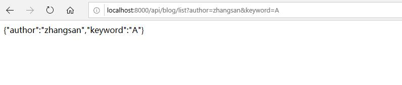
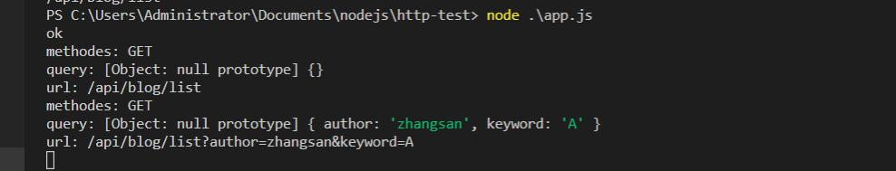
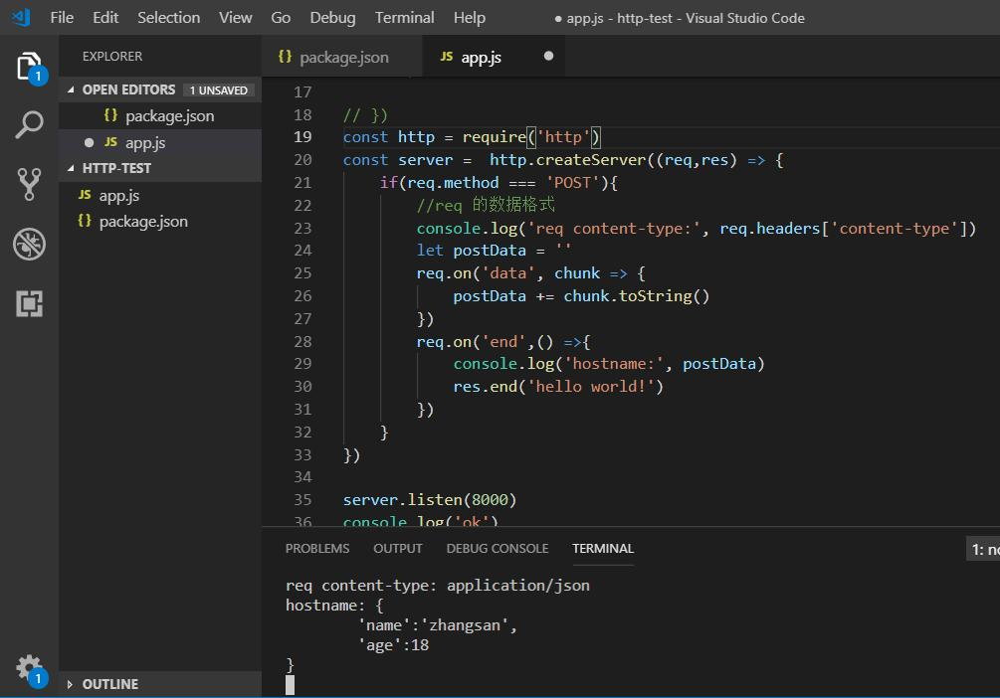
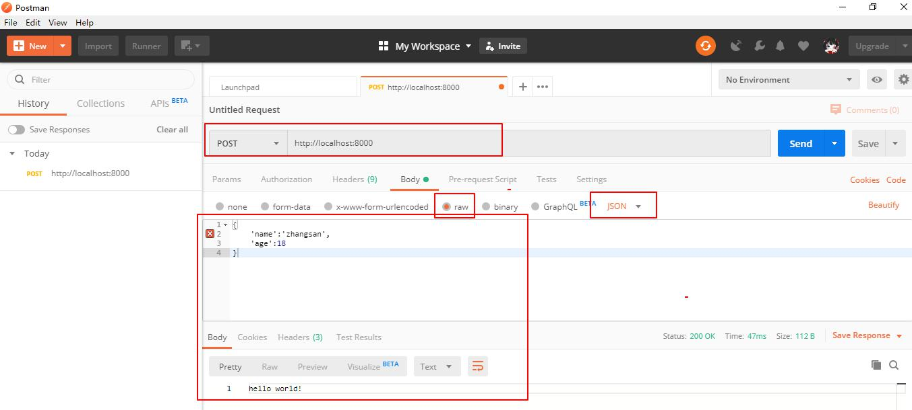

<table>
        <tr><th>我是标题</th></tr>
        <tr><td>tr是行</td></tr>
        <tr><td>td是列</td></tr>
</table>

VUE简介
1.vue是一个javascript 框架, 相比于jquery这样的库,功能更为强大.
要使用vue要遵守一整套规则
2.简化dom操作(以前都是获取元素,操作元素):只需要使用特殊的语法,会自动操作dom元素
3.响应式的数据驱动(页面是由数据来生成的,当数据改变,页面会同步更新

el挂载点
data:数据对象
官方文档:https://cn.vuejs.org

第一个Vue程序:
1.导入开发版本的vue.js
2.创建Vue实例对象,设置el属性和data属性
3.使用简洁语法把数据渲染到页面上  {{}}

el是设置挂载点
设置vue势力管理的元素,设置完毕后,el命中的元素内部,使用两个大括号修饰的部分会被data中同名的数据给替换


VUE实例的作用范围是什么呢?
	Vue会管理el选项命中的元素及其内部的后代元素
	
是否可以使用其他的选择器?
	可以使用其他的选择器,但建议使用id选择器
	
是否可以设置其他的dom元素呢?
	可以使用其他的双标签,不能使用HTML和BODY.


data 是数据对象

字典  数组  字符串


本地应用,实现常见的网页效果,学习vue指令.
vue指令指的是以v-开头的一组特殊语法
1.内容绑定,事件绑定
v-text  v-html  v-on基础

v-text设置标签的文本值,这样的话标签里面的内容全部被替换成v-text指定的内容
v-on 为元素绑定事件
	onclick
	

2.显示切换,属性绑定
v-show  v-if  v-bind

3.列表循环,表单元素绑定
v-for  v-on补充 v-model

1.面向对象编程和面向过程编程的区别：
传统的C语言就是面向过程
面向对象和面向过程编程不是按照语言来划分的。用c++和java也能写出面向过程的代码。而是编程思路

过程：按步骤（第一步  第二步等等）有时候不适合真实的场景
Ajax是异步，不是按顺序的。

class 视频播放组件{
	点赞()
	评论（)
	发弹幕()	
	}
写了这几个方法 对于谁先谁后都不重要了  没有顺序问题


面向对象的核心思维方式  找到角色 确定职责

2.this指向问题
js不支持多态（比如别的语言中有object  obj = new Array(); 数组属于对象，object是一个大的范围，写在前面)
this指代是【当前对象】所谓的当前对象，是指，此刻正在执行这个函数的对象。
谁调用这个函数，this就指向谁

```
function.Person(name){
	this.name = name;
}
let p = new Person();
let obj = {
	print: Person //将Person引用给print
}

obj.print == Person;
Person();         其实是window.Person() this是window，是window调用的
window.Person();
obj.print(); // window.Person();和obj.print()是不一样的调用
```


call是可以改变this指向的

Person.call(document); //等价于document.Person();
方法.call(对象);
对象.方法()；

```
setInterval(Person, 200);

function H
```

```
nvm命令
nvm install xxx 　　　　  //安装版本号
nvm use xxx 　　　　　　  //设置使用版本号
nvm list 　　　　　　　　 //所有的node版本号
nvm alias default v4.2.4  //nvm设置默认node版本号
```

作者：弹指一挥间_e183
链接：https://www.jianshu.com/p/c5575c8351f6
来源：简书
著作权归作者所有。商业转载请联系作者获得授权，非商业转载请注明出处。

引入commonJs做模块化规范

为什么要做模块化  做模块化的话可以把代码进行一些拆分，工具函数分到不同的文件中，在别的地方去引用，拆分以来
这样比较符合单一指导原则和开发工具原则。

做debug   用微软的Vs code 编辑器

新建一个目录  debugger-test
初始化一个npm的环境  npm init -y

会出现一个package.json的文件  里面有'main':'index.js'
在debugger-test文件夹里面新建index.js的文件

http概述
从输入一个url回车到页面显示  经历的过程
1.（浏览器）客户端：DNS解析找到对应ip的服务器，与服务器建立TCP连接(三次握手)，发送http请求
2. server接收到http请求，处理并返回。
3.（浏览器）客户端接收到返回数据，处理数据（如渲染页面，执行js)


新建一个文件夹，然后切到这个文件夹中，执行npm init -y
http的默认端口是80









#### nodemon管理js文件 自动重启
```
npm install --global nodemon
nodemon app.js
```
#### cross-env 设置环境变量  
```
npm install --save-dev cross-env
"scripts": {
    "start": "cross-env NODE_ENV=dev node ./bin/www",
    "build": "cross-env NODE_ENV=production node ./bin/www"
  }
```

```
git pull origin master --allow-unrelated-histories
git push -u origin for_maintain
```
 C:\Users\Administrator\Desktop\ran\hexo\source\_posts

Uncaught TypeError: editormd is not a function
```
hexo clean && hexo g && hexo d
```


